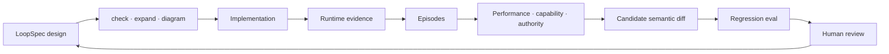

# LoopSpec

**Design the loop. Then test how it changes.**

[Flue coding tutorial](https://loopspec.cyborg.build/flue/) ·
[Getting started](docs/GETTING-STARTED.md) ·
[Language reference](REFERENCE.md) ·
[Checks](docs/CHECKS.md) ·
[Research archive](research/README.md)

> [!WARNING]
> LoopSpec is an early research candidate. Its language, semantics, checks, and tooling may change
> as they are tested against more real systems and independent authors. It is not a standard, a
> safety certification, or proof that a system is stable or effective.

LoopSpec is a declarative language and structural analyzer for agentic feedback loops. It puts a
loop's purpose, boundary, observations, beliefs, decisions, actions, authority, resources, and
stopping conditions into one reviewable YAML artifact.

It helps answer questions that agent frameworks and execution traces usually leave implicit:

- What condition is this system trying to regulate?
- What can it observe, and what must it infer?
- How can an action affect the next observation?
- Who may authorize, interrupt, or stop consequential actions?
- What consumes time, money, tokens, or human attention?
- How will the system discover that a belief or policy stopped working?
- Could joint performance remain high while human capability or authority erodes?

LoopSpec does not run the agent. It is the design and assurance layer between an agent idea, its
implementation, and the evidence produced after deployment.



## Try it

LoopSpec requires Python 3.11 or newer.

```bash
python3 -m venv .venv
.venv/bin/pip install .
.venv/bin/loopspec doctor
```

When developing LoopSpec itself, install it with `.venv/bin/pip install -e .`. You can also replace
`.venv/bin/loopspec` below with `python3 tools/loopspec.py`.

Create `support.loop.yaml`:

```yaml
loop: support_triage
runs: per_ticket

boundary:
  drawn_by: support_lead
  purpose: resolve urgent tickets without losing customer trust
  inside: [triage policy, support queue, engineering escalation]
  outside: [customer situation, product behavior]

goal:
  resolution_time: { keep: below 4 hours }

observes:
  ticket_age:
    informs: resolution_time
    origin: ourselves
    how: measured

processes:
  support_workflow:
    location: inside
    observed_as: [ticket_age]
    description: support and engineering work that changes time to resolution

actions:
  escalate_to_engineer:
    moves: resolution_time
    through: support_workflow
    effect: decrease
    can_undo: yes
    needs_approval: support_lead

when:
  - if: resolution_time exceeds 4 hours
    reads: [resolution_time]
    against: [resolution_time]
    do: escalate_to_engineer

asks_human_when: [evidence conflicts or customer impact is unclear]
asks_human: support_lead

people:
  support_lead:
    human: yes
    loses_if_wrong: the customer relationship
    sees: [resolution_time]
```

Then inspect it from several views of the same canonical graph:

```bash
.venv/bin/loopspec check support.loop.yaml
.venv/bin/loopspec expand support.loop.yaml
.venv/bin/loopspec diagram support.loop.yaml --markdown
```

A valid file may still produce findings. That is expected. A LoopSpec finding is a design question
derived from declared structure, not a verdict about the real system. Fix the model, or record why
the finding is intentionally unresolved and when that decision should be revisited:

```yaml
consider:
  belief_never_checked/ticket_severity:
    because: outcomes arrive too late to score severity per ticket
    revisit: after the first 100 escalated tickets have resolved
```

If the finding later disappears, LoopSpec reports the explanation as stale instead of retaining
obsolete rationale silently.

## What the analyzer checks

LoopSpec turns the authored YAML into typed canonical IR and checks structural obligations across
the whole loop.

| Concern | LoopSpec asks |
|---|---|
| Purpose and boundary | Who selected the system, environment, and regulated condition? |
| Observation and attention | What is sensed, by what method, from where, and at what cost? |
| Belief and calibration | What is inferred, how is it checked against outcomes, and what changes after error? |
| Decision and reference | Which signals and targets does each policy actually read? |
| Action and process | What can the loop change, through which causal path, and with what reversibility? |
| Authority and consequence | Who approves, who can intervene, and who bears the cost of being wrong? |
| Resources and viability | What is consumed, what is bounded, and does policy respond before exhaustion? |
| Control plane | What pauses, resumes, retries, hands off, interrupts, or terminates execution? |

The analyzer can reveal a missing structural precondition. It does **not** prove dynamic stability,
Kalman observability or controllability, requisite variety, safety, or real-world effectiveness.
Those claims require premises and evidence that the current language does not encode.

## Commands

| Command | Purpose |
|---|---|
| `loopspec check agent.loop.yaml` | Validate the file and derive ranked structural findings |
| `loopspec expand agent.loop.yaml` | Emit canonical typed IR v2.2 |
| `loopspec diagram agent.loop.yaml --markdown` | Render the operating-loop projection |
| `loopspec diagram agent.loop.yaml --control --markdown` | Render operations, outputs, and termination paths |
| `loopspec diff before.loop.yaml after.loop.yaml` | Compare canonical meaning rather than YAML formatting |
| `loopspec doctor` | Run tests and generated-language integrity checks |

Machine consumers can request JSON output. The TypeScript integration uses this surface as a
versioned protocol rather than reproducing LoopSpec semantics in another language.

## Runtime evidence is not the specification

A LoopSpec document represents the **design contract**. It should not become a bag of raw logs.
Runtime records are evidence about how a particular design behaved. They become useful to design
when they are bounded into episodes, assessed from explicit viewpoints, and linked to a candidate
semantic change.

| Artifact | Represents | Current status |
|---|---|---|
| `.loop.yaml` | Intended loop structure and governance | Core |
| `LoopEvent` | Privacy-minimised structural observation | Experimental integration |
| Episode | Events for one bounded case under one spec digest | Experimental integration |
| Performance assessment | Whether the human-agent system achieved the outcome | Experimental integration |
| Capability assessment | Whether the human can still perform a critical act unassisted | Explicit HITL evidence required |
| Authority assessment | Whether the accountable human can still prevent a consequence | Explicit application evidence required |
| Candidate spec and eval | An evidence-linked design hypothesis | Human approval required |

This separation matters. A successful trace can show that the joint system completed a task. It
cannot establish that a real person learned, retained, or lost a capability.

## Add LoopSpec with a coding agent

Open your project in any coding agent and paste this prompt:

```text
Read the LoopSpec + Flue coding tutorial at https://loopspec.cyborg.build/flue/ and its linked implementation guide. Inspect this repository before changing it.

Add LoopSpec to this project as a reviewable design and evidence-to-eval layer.

If this project uses Flue, follow the tutorial's Flue integration: project privacy-minimised structural runtime events, join them into episodes using stable IDs, and add explicit application outcomes and human-in-the-loop capability probes.

If this project does not use Flue, adapt the same strategy to its existing framework and observability stack. Do not introduce Flue just for this integration.

In either case:
- keep .loop.yaml as the design contract, not the raw log format;
- keep LoopSpec's canonical parsing, validation, linting, semantic hashing, and diffing in the LoopSpec CLI rather than reimplementing them;
- assess performance, human capability, and authority separately;
- never infer that a real person gained or lost capability from agent traces;
- generate evidence-linked candidate specs and regression evals, but require human approval before adopting or deploying a behavioural change;
- integrate with the project's lint, typecheck, tests, CI, and existing OpenTelemetry instrumentation; and
- preserve its framework conventions, privacy constraints, and security boundaries.

Implement the smallest complete example, run its checks, and explain what changed, what remains synthetic, and what requires human review.
```

Flue is the worked integration, not a required dependency. In another stack, retain LoopSpec as
the canonical design and semantic layer and adapt only the runtime-evidence adapter.

## Flue: evidence to eval

The [LoopSpec + Flue coding tutorial](https://loopspec.cyborg.build/flue/) demonstrates the full
experimental path on an existing Flue GitHub channel:

1. project `@flue/runtime` observations into a small structural event contract;
2. use the dispatch receipt's `submissionId` to join verified ingress and runtime events;
3. add application outcomes and a delayed human-only capability probe;
4. assess the same episodes separately for performance, capability, and authority;
5. generate an evidence-linked candidate `.loop.yaml` that requires human approval;
6. validate it and produce a semantic diff through the canonical LoopSpec engine; and
7. generate a removal-probe regression eval for CI.

The tutorial is runnable without model credentials or external services after dependencies are
installed. Its synthetic sequence deliberately keeps assisted performance high while human-only
recovery and the intervention window decline.

- [Open the coding tutorial](https://loopspec.cyborg.build/flue/)
- [Read the machine-facing implementation guide](https://loopspec.cyborg.build/flue/blueprint.md)
- [Inspect the runnable reference](examples/flue-evidence-to-eval/)

## Python core, TypeScript integrations

The current packaging boundary is deliberate:

- **Python** remains the canonical parser, expander, linter, semantic hasher, and diff engine.
- **TypeScript** owns Flue-native event projection, channel integration, episode assembly, typed
  domain evidence, eval harnesses, and the `LoopSpecEngine` interface.
- A Node adapter calls the CLI with `spawn()` and an argument array and requires
  `protocol_version: 1`.
- Cloudflare Workers collect or enqueue privacy-minimised evidence at the edge; they do not try to
  spawn Python.

A native TypeScript semantic engine should replace the adapter only after cross-language fixtures
prove exact parity for IR, findings, semantic hashes, and semantic diffs. See
[TypeScript integration strategy](docs/TYPESCRIPT-INTEGRATION.md).

## Observability and interchange

The experimental episode path is designed to compose with existing tooling:

- use Flue's OpenTelemetry integration for model, tool, task, and agent-operation spans;
- represent LoopSpec evidence as low-cardinality OpenTelemetry events or structured log records;
- propagate W3C `traceparent` and `tracestate` across HTTP boundaries;
- use CloudEvents 1.0 as an optional transport envelope when episodes cross service boundaries;
- keep LoopSpec event-schema versions independent of transport-envelope versions; and
- treat GenAI prompts, outputs, reasoning, tool arguments, and results as sensitive and opt-in.

The default integration records structural facts, hashed correlation identifiers, explicit domain
outcomes, and deliberately collected human assessments—not content-bearing traces.

## CI

For a project that owns LoopSpec files, the minimum useful gate is:

```yaml
name: Loop specifications
on: [push, pull_request]

jobs:
  loopspec:
    runs-on: ubuntu-latest
    permissions:
      contents: read
    timeout-minutes: 10
    steps:
      - uses: actions/checkout@v4
      - uses: actions/setup-python@v5
        with:
          python-version: "3.11"
      - run: pip install .
      - run: loopspec check examples/complete.loop.yaml
      - run: loopspec doctor
```

An evidence-to-eval integration should additionally run its TypeScript linter, typecheck, unit
tests, candidate-spec check, semantic diff, and eval suite. It should not receive production
credentials.

## Examples

| Example | What it demonstrates |
|---|---|
| [`examples/complete.loop.yaml`](examples/complete.loop.yaml) | Most language constructs in one validated specification |
| [`examples/customer_acquisition.loop.yaml`](examples/customer_acquisition.loop.yaml) | Goals, beliefs, calibration, resources, and irreversible action |
| [`examples/research_group.loop.yaml`](examples/research_group.loop.yaml) | Multiple interacting research and governance concerns |
| [`examples/field/ralph.loop.yaml`](examples/field/ralph.loop.yaml) | A field encoding of the Ralph agent loop |
| [`examples/flue-evidence-to-eval/`](examples/flue-evidence-to-eval/) | Flue events, episodes, assessment groups, a candidate spec, and `vitest-evals` |
| [`research/real_loops/`](research/real_loops/) | Source-pinned encodings of existing agent systems |

## Documentation map

| Read | Purpose |
|---|---|
| [`docs/GETTING-STARTED.md`](docs/GETTING-STARTED.md) | Write, lint, revise, and draw a first loop |
| [`docs/COOKBOOK.md`](docs/COOKBOOK.md) | Model reflection, judges, RAG, search, and verifier loops |
| [`docs/LINTING-EXISTING.md`](docs/LINTING-EXISTING.md) | Reverse-engineer a loop without inventing unsupported structure |
| [`docs/CONTROL-PLANE.md`](docs/CONTROL-PLANE.md) | Separate actions, operations, outputs, and conditional safety |
| [`docs/CHECKS.md`](docs/CHECKS.md) | Understand every finding and its assurance boundary |
| [`docs/TYPESCRIPT-INTEGRATION.md`](docs/TYPESCRIPT-INTEGRATION.md) | Understand the host-language and semantic-engine boundary |
| [`REFERENCE.md`](REFERENCE.md) | Browse every accepted language key |
| [`COMPATIBILITY.md`](COMPATIBILITY.md) | Understand authoring and canonical-IR compatibility |
| [`CYBERNETICS.md`](CYBERNETICS.md) | See what is genuinely cybernetic and what remains outside the model |
| [`ATTENTION.md`](ATTENTION.md) | Model signals, selection cost, and human attention |
| [`CALIBRATION.md`](CALIBRATION.md) | Connect beliefs to outcome scoring and revision |
| [`RULESET.md`](RULESET.md) | Review checks, assurance levels, and theorem boundaries |

The searchable Astro manual lives in [`website/`](website/).

## Development

```bash
python3 -m venv .venv
.venv/bin/pip install -e .
.venv/bin/pytest -q
.venv/bin/loopspec doctor
```

To validate the website:

```bash
cd website
npm install
npm run check
```

To validate the Flue reference implementation:

```bash
cd examples/flue-evidence-to-eval
npm ci
npm run check
```

## Evidence and compatibility

LoopSpec package version: **2.0.0**

- **Authoring v1.1:** accepted compatibility baseline
- **Authoring v1.2:** experimental control-plane additions
- **Canonical IR v2.2:** experimental typed operations, outputs, and action profiles
- **CLI JSON protocol v1:** integration boundary for canonical semantics

The `uras` command remains a deprecated compatibility alias during LoopSpec 2.x and is scheduled
for removal in 3.0. Research protocols, results, negative findings, and project history live in
the [research archive](research/README.md).

## What LoopSpec is not

- It is not an agent runtime, workflow engine, or orchestration framework.
- It is not a prompt format or a replacement for executable tests.
- It is not a raw telemetry format or a claim generator.
- It is not formal proof of system safety, stability, or real-world effectiveness.
- It is not yet a standards-body specification.
