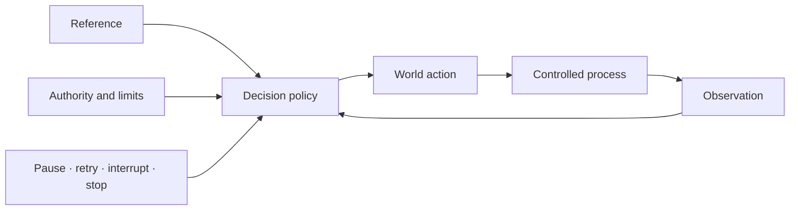

# LoopSpec

> **Design the loop, not just the agent.**

> [!WARNING]
> **LoopSpec is very much a work in progress and an early research candidate.** Its language,
> semantics, checks, and tooling may change substantially as they are tested against more real
> agent loops and independent authors. It is not a standard, a safety certification, or a
> production control boundary. Use it to expose and discuss design assumptions—not as evidence
> that a system is safe, stable, or effective.

LoopSpec is a declarative specification language and structural design toolkit for agentic
feedback loops. It makes a loop's purpose, boundary, observations, beliefs, decisions, actions,
authority, resources, and stopping conditions explicit in one reviewable artifact.

Write a human-readable YAML specification, then use LoopSpec to:

- find missing feedback, actuation, limits, approval, escalation, and calibration paths;
- distinguish world actions from operations that pause, retry, interrupt, or stop the controller;
- draw the operating loop and its control plane;
- compare revisions by canonical meaning rather than YAML text; and
- check whether an implementation silently dropped declared safeguards.

LoopSpec is the design and assurance layer between an agent idea and its implementation. It is
framework-neutral: it does not run the agent and it does not prescribe an orchestration stack.

## Why specify a loop?

Agent frameworks make it easy to connect a model to tools. That does not establish that the
resulting system has a coherent feedback structure.

A useful loop needs answers to questions such as:

- What condition is it trying to regulate?
- What can it observe, and what must it infer?
- Through what process can its actions affect the next observation?
- Which actions are reversible, and who authorizes the others?
- What consumes time, money, tokens, or attention?
- When does it stop, ask for help, or revise a failing belief?

Those answers usually live across prompts, code, configuration, and institutional knowledge.
LoopSpec puts them in one artifact that people and tools can inspect before runtime.



## Getting started

LoopSpec requires Python 3.11 or newer. Install it from this repository:

```bash
python3 -m venv .venv
.venv/bin/pip install .
.venv/bin/loopspec doctor
```

Use `.venv/bin/pip install -e .` when developing LoopSpec itself. You can also replace
`.venv/bin/loopspec` in the examples below with `python3 tools/loopspec.py`.

### 1. Write the smallest useful loop

Create `support.loop.yaml`:

```yaml
loop: support_triage
runs: per_ticket

goal:
  resolution_time: { keep: below 4 hours }

observes:
  ticket_age:
    informs: resolution_time
    origin: ourselves
    how: measured

actions:
  escalate_to_engineer:
    moves: resolution_time
    effect: decrease
    can_undo: yes

when:
  - if: resolution_time exceeds 4 hours
    reads: [resolution_time]
    against: [resolution_time]
    do: escalate_to_engineer
```

This is enough to express feedback intent: a target, a measurement, an actuator, and a policy
that compares the measurement with its reference. Partial specifications are valid input; the
linter helps you discover what the first draft omitted, including the causal path through the
controlled process.

### 2. Check, draw, and expand it

```bash
.venv/bin/loopspec check support.loop.yaml
.venv/bin/loopspec diagram support.loop.yaml --markdown
.venv/bin/loopspec expand support.loop.yaml
```

`check` will accept the document and raise design questions such as the missing system boundary,
human escalation path, and explicit process through which escalation changes resolution time.
That is expected. The goal is not zero findings; it is a design whose findings have been resolved
or consciously considered.

### 3. Add the system and governance around the loop

Grow the same file into a reviewable system description:

```yaml
loop: support_triage
runs: per_ticket

boundary:
  drawn_by: support_lead
  purpose: resolve urgent tickets without losing customer trust
  inside: [triage policy, support queue, engineering escalation]
  outside: [customer situation, product behavior]

goal:
  resolution_time: { keep: below 4 hours }

observes:
  ticket_age:
    informs: resolution_time
    origin: ourselves
    how: measured

processes:
  support_workflow:
    location: inside
    observed_as: [ticket_age]
    description: support and engineering work that changes time to resolution

actions:
  escalate_to_engineer:
    moves: resolution_time
    through: support_workflow
    effect: decrease
    can_undo: yes

when:
  - if: resolution_time exceeds 4 hours
    reads: [resolution_time]
    against: [resolution_time]
    do: escalate_to_engineer

asks_human_when: [evidence conflicts or the customer impact is unclear]
asks_human: support_lead

people:
  support_lead:
    human: yes
    loses_if_wrong: the customer relationship
    sees: [resolution_time]
```

Re-run the checker after each meaningful decision:

```bash
.venv/bin/loopspec check support.loop.yaml
```

Fix a finding in the model, or record an intentional exception without suppressing it:

```yaml
consider:
  belief_never_checked/ticket_severity:
    because: outcomes arrive too late to score severity per ticket
    revisit: after the first 100 escalated tickets have resolved
```

If the finding later disappears, LoopSpec reports the explanation as stale rather than silently
keeping obsolete design rationale.

## Add beliefs and calibration

Use a belief when the loop must estimate something it cannot observe directly. A calibration
contract connects that judgement to later outcomes and states what should change when it is
unreliable.

```yaml
beliefs:
  ticket_severity:
    question: How badly is this customer blocked?
    how: judgement
    checked_by: weekly_severity_review
    checked_against: ticket_outcome
    scoring_rule: severity classification error
    window: 100 resolved tickets
    adjusts: severity_prompt
    every: weekly

observes:
  ticket_text:
    informs: ticket_severity
    origin: outside
    how: reported
  ticket_outcome:
    informs: [ticket_severity, resolution_time]
    origin: outside
    how: measured
```

This distinguishes verification—“is this answer good?”—from calibration—“has confidence in this
kind of judgement tracked reality over time, and what changes if it has not?”

## Model conditional tool safety

A generic tool action may only become irreversible after its concrete request is known. Profiles
let safety properties vary without claiming that every tool call is dangerous.

```yaml
actions:
  execute_tool:
    moves: task_progress
    through: tool_environment

action_profiles:
  destructive_request:
    action: execute_tool
    when: the request can delete or publish external state
    resolved_at: request
    can_undo: no
    needs_approval: operator
  other_request:
    action: execute_tool
    default: true
    resolved_at: request
    can_undo: unknown
```

The default is deliberately `unknown`, not silently reversible. LoopSpec checks that conditional
profiles have a fallback and that they represent a real safety distinction.

## Model the control plane

World actions are not the same as operations on the controller. A file edit is an `action`; a
retry, pause, handoff, interrupt, or stop is an `operation`; a final answer or approval request is
an `output` crossing the represented boundary.

```yaml
outputs:
  approval_request: { kind: approval_request, terminates: run }
  final_result:     { kind: final, terminates: run }
  terminal_error:   { kind: failure, terminates: run }

operations:
  defer_for_approval:
    kind: pause
    when: this invocation returns resumable approval state
    emits: approval_request
  continue_deferred_run:
    kind: resume
    when: a later invocation supplies the decision
    authorized_by: run_caller
  finish_successfully:
    kind: stop
    when: validated final output is ready
    emits: final_result
  finish_with_error:
    kind: stop
    when: a terminal limit or error is reached
    emits: terminal_error
```

Render that projection separately:

```bash
.venv/bin/loopspec diagram agent.loop.yaml --control --markdown
```

The v1.2 control-plane vocabulary is experimental; see [Evidence and maturity](#evidence-and-maturity).

## Compare designs by meaning

Text diffs are noisy when a key is renamed or a list is reordered. LoopSpec expands both files
to canonical semantic fingerprints before comparing them:

```bash
.venv/bin/loopspec diff before.loop.yaml after.loop.yaml
```

This exposes changes such as a removed approval gate, a new observation dependency, or a changed
termination role even when the surrounding YAML was reformatted.

## Use LoopSpec in CI

Run the checker on the specifications your project depends on. In the LoopSpec repository,
`doctor` additionally verifies tests and generated language artifacts.

```yaml
name: Loop specifications
on: [push, pull_request]

jobs:
  loopspec:
    runs-on: ubuntu-latest
    steps:
      - uses: actions/checkout@v4
      - uses: actions/setup-python@v5
        with:
          python-version: "3.11"
      - run: pip install .
      - run: loopspec check examples/complete.loop.yaml
      - run: loopspec doctor
```

## The design model

LoopSpec treats cybernetics as a set of explicit modeling obligations, not as decorative
terminology.

| Concern | LoopSpec asks |
|---|---|
| Purpose and boundary | Who selected the system, environment, and condition to regulate? |
| Observation and attention | What is sensed, from where, by what method, and at what cost? |
| Belief and calibration | What is inferred, how is it scored against outcomes, and what changes after error? |
| Decision and reference | Which signals and targets does each rule actually read? |
| Action and process | What can the loop change, through which causal path, and with what reversibility? |
| Authority and consequence | Who approves, who is informed, and who bears the cost of being wrong? |
| Resources and viability | What is consumed, what is bounded, and does the policy respond before exhaustion? |
| Control plane | What pauses, resumes, retries, hands off, interrupts, or terminates execution? |

The analyzer checks the declared structure. It does **not** prove dynamic stability,
controllability, observability, safety, or real-world effectiveness. Those stronger claims need
runtime evidence and, in some cases, quantitative models that LoopSpec does not represent.

## Commands

```bash
loopspec check   agent.loop.yaml
loopspec expand  agent.loop.yaml
loopspec diagram agent.loop.yaml --markdown
loopspec diagram agent.loop.yaml --control --markdown
loopspec diff    before.loop.yaml after.loop.yaml
loopspec doctor
```

All projections read the same validated canonical graph:

- `check` validates a specification and derives ranked structural findings;
- `expand` emits canonical typed IR v2.2;
- `diagram` renders operating-loop or control-plane Mermaid;
- `diff` compares semantic fingerprints rather than source formatting; and
- `doctor` runs tests plus generated-reference and schema-integrity gates.

Additional research tools compare loop corpora and check declared elements against generated
implementations:

```bash
python3 tools/compare.py specs/*.loop.yaml
python3 tools/verify.py agent.loop.yaml build/
```

`verify.py` detects declared elements that disappeared during implementation. It does not prove
that the resulting program behaves correctly.

## Examples

The repository includes small designed examples and source-backed encodings of existing agent
systems.

| Example | What it demonstrates |
|---|---|
| [`examples/complete.loop.yaml`](examples/complete.loop.yaml) | Most language constructs in one validated specification |
| [`examples/customer_acquisition.loop.yaml`](examples/customer_acquisition.loop.yaml) | Goals, beliefs, calibration, resources, and irreversible action |
| [`examples/research_group.loop.yaml`](examples/research_group.loop.yaml) | Multiple interacting research and governance concerns |
| [`examples/field/ralph.loop.yaml`](examples/field/ralph.loop.yaml) | A field encoding of the Ralph agent loop |
| [`research/real_loops/`](research/real_loops/) | Source-pinned Ralph, autoresearch, SWE-agent, Browser Use, Codex, Goose, OpenHands, and AI Scientist cases |

Try one without creating a file:

```bash
.venv/bin/loopspec check examples/complete.loop.yaml
.venv/bin/loopspec diagram examples/field/ralph.loop.yaml --markdown
```

## Documentation

| Start here | Purpose |
|---|---|
| [`docs/GETTING-STARTED.md`](docs/GETTING-STARTED.md) | Write and lint your first loop |
| [`docs/COOKBOOK.md`](docs/COOKBOOK.md) | Model reflection, judges, RAG, search, and verifier loops |
| [`docs/LINTING-EXISTING.md`](docs/LINTING-EXISTING.md) | Reverse-engineer and lint a loop you did not design |
| [`docs/CONTROL-PLANE.md`](docs/CONTROL-PLANE.md) | Separate actions, controller operations, outputs, and conditional safety |
| [`docs/CHECKS.md`](docs/CHECKS.md) | Understand every finding and its assurance boundary |
| [`REFERENCE.md`](REFERENCE.md) | Browse every accepted language key |
| [`COMPATIBILITY.md`](COMPATIBILITY.md) | Understand authoring and canonical-IR compatibility |

For the theory, evidence, and limits:

| Read next | Purpose |
|---|---|
| [`SYNTHESIS.md`](SYNTHESIS.md) | The field-level argument and bounded contribution |
| [`CYBERNETICS.md`](CYBERNETICS.md) | What is genuinely cybernetic and what is still missing |
| [`ATTENTION.md`](ATTENTION.md) | Signals, selection, cost, and attention as meta-control |
| [`CALIBRATION.md`](CALIBRATION.md) | Outcome scoring and revision of unreliable belief formation |
| [`RULESET.md`](RULESET.md) | Checks, assurance levels, and theorem boundaries |
| [`REFERENCES.md`](REFERENCES.md) | External sources and the decisions they shaped |
| [`research/real_loops/`](research/real_loops/) | Source-pinned encodings of real agent loops |

The searchable Astro manual lives in [`website/`](website/):

```bash
cd website
npm install
npm run dev
```

Run `npm run check` there to rebuild the site and validate its routes, anchors, generated pages,
assets, and worker.

## Evidence and maturity

The package is version 2.0.0. Its current semantic layers are:

- **authoring v1.1:** accepted compatibility baseline;
- **authoring v1.2:** experimental control-plane additions; and
- **canonical IR v2.2:** experimental typed operations, outputs, and action profiles.

The v1.2 vocabulary is internally verified, but an eight-cycle independent-encoding study
scored **0.467 raw micro-F1** against a preregistered **0.80** convergence threshold. It therefore
remains an experimental candidate rather than a settled field standard. The complete negative
result is retained in [`research/control_plane/`](research/control_plane/) and
[`autoresearch/control-plane-260804-2251/`](autoresearch/control-plane-260804-2251/).

The external-author usefulness protocol is preregistered in
[`research/external_validation/PREREGISTRATION.md`](research/external_validation/PREREGISTRATION.md)
and has no observed outcomes yet. LoopSpec currently claims useful structural specification and
review machinery—not proven field usefulness or operational safety.

## What LoopSpec is not

- It is not an agent runtime, workflow engine, or orchestration framework.
- It is not a prompt format or a replacement for executable tests.
- It is not a formal proof of system safety or stability.
- It is not yet a standards-body specification.

## Project history

LoopSpec began as **URAS**, a proposed universal representation for adaptive systems. Evidence
did not support that scope, so the project narrowed to agent control loops. The old `uras`
command remains a deprecated alias throughout LoopSpec 2.x.

[`research/ORIGINAL-CHARTER.md`](research/ORIGINAL-CHARTER.md) preserves the original premise,
[`FORK.md`](FORK.md) records the narrowing, and [`CONVERGENCE.md`](CONVERGENCE.md) records the
evidence gates. Those documents are research history, not promises made by the language.
