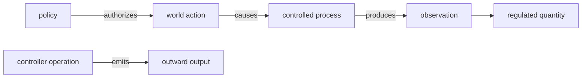

# Model the control plane

Agent code often calls everything an “action.” LoopSpec separates three effects that have
different safety and review consequences:

| Declare | Meaning | Examples |
|---|---|---|
| `actions` | changes the represented world or controlled process | edit a file, click a browser control, call a deployment tool |
| `operations` | changes execution of the controller | pause, resume, interrupt, retry, compact, hand off, stop |
| `outputs` | crosses the represented loop boundary | final result, approval request, submission, status event, failure |

A `done` tool whose only effect is to end execution is therefore a `stop` operation. A tool that
deletes a remote resource is an action even when the runtime dispatches both through the same
function-call mechanism.



The lower path is the operating feedback loop. The upper-right pair describes what happens to
the controller itself. Keeping them distinct prevents a retry from inheriting file-reversibility
checks or a browser click from disappearing into generic execution control.

## Conditional tool safety

Use `action_profiles` only when reversibility or approval really varies. Put a non-varying
unknown directly on the action; a lone default profile adds no information.

```yaml
actions:
  execute_tool:
    moves: task_progress
    through: tool_environment

action_profiles:
  destructive_request:
    action: execute_tool
    when: the concrete request can delete or publish external state
    resolved_at: request
    can_undo: no
    needs_approval: operator
  other_request:
    action: execute_tool
    default: true
    resolved_at: request
    can_undo: unknown
```

This does not claim every tool call needs approval. It says the gate is selected for a concrete
request, and unmatched requests remain explicitly unproven rather than silently safe.

## Suspension versus waiting

A resumable return exposed by the public API is a `pause`; the later public transition is
`resume`. An approval that is awaited inside one still-running call is only an action gate, not a
pause/resume pair. Likewise, `interrupt` cancels an active step asynchronously; a stop flag polled
between steps is a `stop`.

```yaml
outputs:
  approval_request: { kind: approval_request, terminates: run }
  final_result:     { kind: final,            terminates: run }
  terminal_error:   { kind: failure,          terminates: run }

operations:
  defer_for_approval:
    kind: pause
    when: this invocation returns resumable approval state
    emits: approval_request
  continue_deferred_run:
    kind: resume
    when: a later invocation supplies the decision
    authorized_by: run_caller
  finish_successfully:
    kind: stop
    when: validated final output is ready
    emits: final_result
  finish_with_error:
    kind: stop
    when: a terminal limit or error is reached
    emits: terminal_error
```

## Canonical identity rules

- Merge outputs with the same `(kind, terminates)` role.
- Merge operations with the same `(kind, authorized_by, emitted output-role set)`.
- Merge profile selectors when binding stage, reversibility, and approver match.
- Do not infer a human from a generic API caller.
- Do not model ordinary invocation as `start`, or logs and nested result fields as outputs.

Run the normal gates after authoring:

```bash
loopspec check agent.loop.yaml
loopspec diagram agent.loop.yaml --control --markdown
loopspec expand agent.loop.yaml
```

## Evidence status

These v1.2 constructs are experimental. They distinguish the intended graph types and validate
mechanically, but an eight-cycle independent-encoding study did not meet its 0.80 convergence
threshold. Use them to make disagreements inspectable; do not cite the current vocabulary as a
settled standard. The study ledger is preserved in
`autoresearch/control-plane-260804-2251/`.
